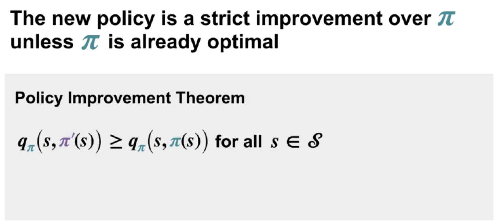
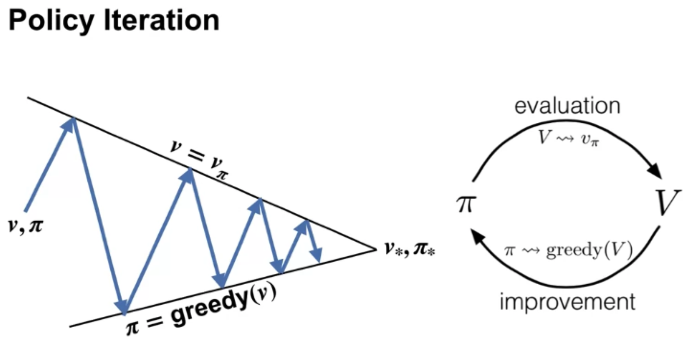

## **Lesson 1: Policy Evaluation (Prediction)**
* Understand the distinction between policy evaluation and control
  * Policy evaluation is the task of determining the state value function V_pi for a specific policy pi. Policy evaluation is the task of determining the state value function v pi for a particular policy pi.
  * Control is the task of finding a policy to obtain as much reward as possible. In other words, **finding a policy which maximizes the value function.** Control is the ultimate goal of reinforcement learning.
  * The goal of the control task is to modify a policy to produce a new one which is strictly better.Control is the task of improving an existing policy.
* Explain the setting in which dynamic programming can be applied, as well as its limitations
  * Dynamic programming uses the various Bellman equations we've seen, along with knowledge of p, to work out value functions and optimal policies. Classical dynamic programming does not involve interaction with the environment at all. Instead, we use dynamic programming methods to compute value functions and optimal policies given a model of the MDP.
  *  dynamic programming is very useful for understanding other reinforced learning algorithms. Most reinforced learning algorithms can be seen as an approximation to dynamic programming without the model.

* Outline the **iterative policy evaluation** algorithm for estimating state values under a given policy
  * we have a procedure we can apply to iteratively refine our estimate of the value function.
* Apply iterative policy evaluation to compute value functions

## **Lesson 2: Policy Iteration (Control)**
* Understand the **policy improvement theorem**
  * the policy improvement theorem tells us that greedified pi policy is a strict improvement, unless the original policy was already optimal.
  * 
  * Policy Pi prime is at least as good as Pi if in each state, the value of the action selected by Pi prime is greater than or equal to the value of the action selected by Pi. Policy pi prime is strictly better if the value is strictly greater and at least one state. 
* Use a value function for a policy to produce a better policy for a given MDP
* Outline the policy iteration algorithm for finding the optimal policy
  * Evalueation and Improvement 
  * Deterministic ->  Each policy generated in this way is deterministic. There are finite number of deterministic policies, so this iterative improvement must eventually reach an optimal policy.
* Understand “the dance of policy and value”, how policy iteration reaches the optimal policy by alternating between evaluating policy and improving it,
  * 
  * We can visualize this dance as bouncing back and forth between one line, where the value function is accurate, and another where the policy is greedy. These two lines intersect only at the optimal policy and value function. Policy iteration always makes progress towards the intersection by projecting first onto the line v equals v Pi, and then onto the line where Pi is greedy with respect to v. Of course, the real geometry of the space of policies and value functions is more complicated, but the same intuition holds.
  * 
* Apply policy iteration to compute optimal policies and optimal value functions

## **Lesson 3: Generalized Policy Iteration**
* Understand the framework of generalized policy iteration
  * **We use the term generalized policy iteration (GPI) to refer to the general idea of letting policy-evaluation and policy-improvement processes interact, independent of the granularity and other details of the two processes. **
  * Generalized policy iteration *unifies* classical DP methods, value iteration, and asynchronous DP.
  * value iteration -> In value iteration, we still sweep over all the states and greedify with respect to the current value function. However, we do not run policy evaluation to completion. We perform just one sweep over all the states. 
* Outline value iteration, an important example of generalized policy iteration
* Understand the distinction between synchronous and asynchronous dynamic programming methods
  * synchronous -> methods that perform systematic weeps, this can be problematic if the statespace is large. -> every step could take a very long time.
  * Asynchronous dynamic programming algorithms update a given state many times before another is updated even once. 
    * In order to guarantee convergence, asynchronous algorithms must continue to update the values of all states.
    * Asynchronous algorithms can propagate value information quickly through selective updates. Sometimes this can be more efficient than a systematic sweep.
    * Asynchronous dynamic programming methods give us the freedom to ipdate states in any order.

* Describe **brute force search** as an alternative method for searching for an optimal policy
  * This method simply evaluates every possible deterministic policy one at a time, we then pick the one with the highest value. There are a finite number of deterministic policies, and there always exists an optimal deterministic policy. So brute-force search will find the answer eventually.
  * However, the number of deterministic policies can be huge.
  * A deterministic policy consists of one action choice per state. So the total number of deterministic policies is exponential in the number of states. Even on a fairly simple problem, this number could be massive, this process could take a very long time. 
* Describe** Monte Carlo** as an alternative method for learning a value function
  * The procedure is simple, first, we gather a large number of returns under pi and take their average. This will eventually converge to the state value, this is called the Monte Carlo method.
* Understand the advantage of Dynamic programming and **“bootstrapping” over these alternative strategies** for finding the optimal policy
  * This process of using the value estimates of successor states to improve our current value estimate is known as bootstrapping. This can be much more efficient than a Monte Carlo method that estimates each value independently.
  * bootstrapping can save us from performing a huge amount of unnecessary work by exploiting the connection between the value of a state and its possible successors.

## Conclusion:
The key insight of dynamic programming is that we do not have to treat the evaluation of each state as a separate problem. We can use the other value estimates we have already worked so hard to compute.