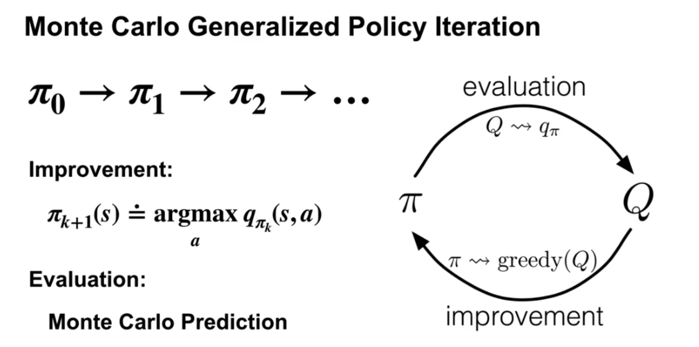
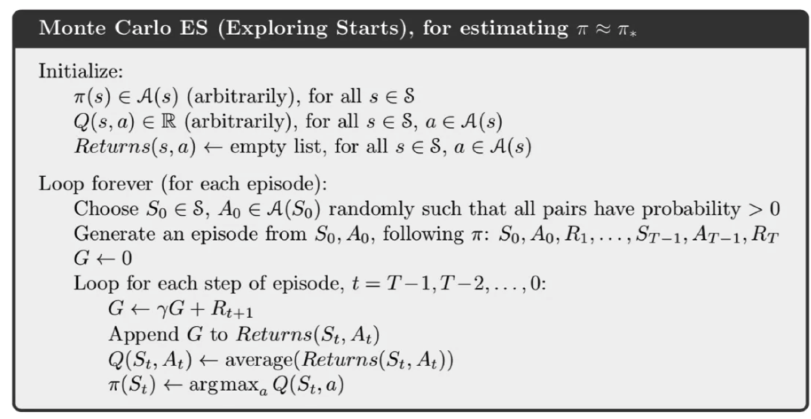

## Module 01: Monte Carlo Methods for Prediction & Control 
#### Lesson 1: Introduction to Monte Carlo Methods 
* Understand how Monte-Carlo methods can be used to estimate value functions from sampled interaction
  * MC methods estimate values by **averaging** over a large number of **random samples**.
  * 采样越多，找到的解越接近最优解 => As the number of samples increases, the average tends to get closer and closer to the expected return.
  * 
  The Monte Carlo algorithm has to keep track of multiple observed returns
  * MC method can learn directly from interacton, they don't need a model the environments dynamics.
* Identify problems that can be solved using Monte-Carlo methods
  * In some problems we don't know the environment's transition probabilities. => use MC
  * We dont need to keep a **large model** of the environment
  * We are estimating the value of an **individual** state independently of the values of other states. HOWEVER, in dynamic programming, the value of each state depends on the values of other states. (*DIFFERENCE*)
  * The **computation** needed to update the value of each state **doesnt** depend on the size of the MDP ❌-> depends on the length of an episode ✅
* Use **Monte Carlo prediction** to estimate the value function for a given policy. 
Example: Blackjack 二十一点！ -> reform this game as an **undiscounted MDP** (assume cards are dealt from a deck with replacement)
  * where each game of blackjack corresponds to an episode.
  * Rewards: loss -1, draw 0, win 1
  * ActionL Hit or Stick
  * States (*200 in total*):
    * whether the player has a usable Ace(counted as 11) (yes or no)
    * The sum of the player's cards (12-21)
    *  The card the dealer shows(Ace - 10)
 *  Policy: Stop requesting cards when the player's sun is 20 or 21
* In what situations could off-policy learning be more data efficient that on-policy learning?
  * Off-policy means using two different policies, one the target policy, to be learned, and another the off-policy to make sure we do also explore for more optimal actions. This can be a preferred option when a more general policy is required. For example if we learn from generated data from a conventional controller or human expert. In short, more real world dynamics situation.
  * ***Off-polic***y learning could be better when there are lots of different actions that could proof to be ultimately better in the long run, but poor choices short and intermediate term. 
  * ***On-policy*** learning would not explore and find these (very long term good action sequences) because it only explores short-term but then selects greedily. It would not find a sequence of several poor choices before it pays off, because of the high probability of greedy choices.
  

#### Lesson 2: Monte Carlo for Control 
* Estimate action-value functions using Monte Carlo
  * We learned the value of a state by averaging sample returns from that state, same as action values.
* Understand the importance of maintaining exploration in Monte Carlo algorithms 
  *  If we don't ever try the new way, then we couldn't know if it was actually better
  *  Exploring starts - one way to maintain exploration

* Understand how to use monte carlo methods to implement a **GPI algorithm**
  * 
  * GPI algorithms produce sequences of policies that are at least as good as the policy before them. 
  * Policy improvement step -> make policy greedy wrt. the agent current action value estimates.
  * policy evaluation step -> use ***MC estimate*** to estimate action values. 
  * 
    * You use exploring starts so that each episode begins with a randomly selected state and action. 
    * Then, the agent generates an episode by following his policy, keeping track of the states, actions, and rewards along the way. 
    * Once the episode is complete, it computes each return starting from the end of the episode. Then, it adds the return to the appropriate list. The list of returns are then averaged to update the action value estimates for each state-action pair. 
    * This completes the policy evaluation step. After policy evaluation, then do policy improvement. We simply update the policy to take the greedy action with respect to our updated action values. 
* Apply Monte Carlo with exploring starts to solve an MDP 

#### Lesson 3: Exploration Methods for Monte Carlo 
* Understand why Exploring Starts can be problematic in real problems 
* Describe an alternative exploration method for Monte Carlo control 

#### Lesson 4: Off-policy learning for prediction 
* Understand how off-policy learning can help deal with the exploration problem 
* Produce examples of target policies and examples of behavior policies.
* Understand importance sampling
* Use importance sampling to estimate the expected value of a target distribution using samples from a different distribution. 
* Understand how to use importance sampling to correct returns
* Understand how to modify the monte carlo prediction algorithm for off-policy learning. 