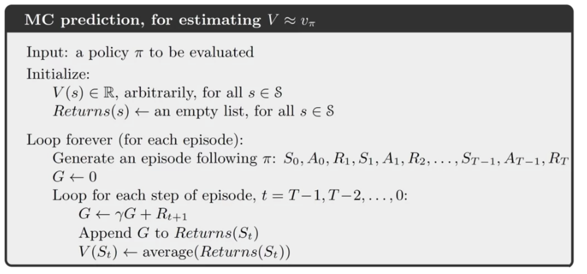

## Module 01: Monte Carlo Methods for Prediction & Control 
#### Lesson 1: Introduction to Monte Carlo Methods 
* Understand how Monte-Carlo methods can be used to estimate value functions from sampled interaction
  * MC methods estimate values by **averaging** over a large number of **random samples**.
  * 采样越多，找到的解越接近最优解 => As the number of samples increases, the average tends to get closer and closer to the expected return.
  * 
  The Monte Carlo algorithm has to keep track of multiple observed returns
  * MC method can learn directly from interacton, they don't need a model the environments dynamics.
* Identify problems that can be solved using Monte-Carlo methods
  * In some problems we don't know the environment's transition probabilities. => use MC
  * We dont need to keep a **large model** of the environment
  * We are estimating the value of an **individual** state independently of the values of other states. HOWEVER, in dynamic programming, the value of each state depends on the values of other states. (*DIFFERENCE*)
  * The **computation** needed to update the value of each state **doesnt** depend on the size of the MDP ❌-> depends on the length of an episode ✅
* Use **Monte Carlo prediction** to estimate the value function for a given policy. 
Example: Blackjack 二十一点！ -> reform this game as an **undiscounted MDP** (assume cards are dealt from a deck with replacement)
  * where each game of blackjack corresponds to an episode.
  * Rewards: loss -1, draw 0, win 1
  * ActionL Hit or Stick
  * States (*200 in total*):
    * whether the player has a usable Ace(counted as 11) (yes or no)
    * The sum of the player's cards (12-21)
    *  The card the dealer shows(Ace - 10)
 *  Policy: Stop requesting cards when the player's sun is 20 or 21

#### Lesson 2: Monte Carlo for Control 
* Estimate action-value functions using Monte Carlo
* Understand the importance of maintaining exploration in Monte Carlo algorithms 
* Understand how to use monte carlo methods to implement a GPI algorithm. 
* Apply Monte Carlo with exploring starts to solve an MDP 

#### Lesson 3: Exploration Methods for Monte Carlo 
* Understand why Exploring Starts can be problematic in real problems 
* Describe an alternative exploration method for Monte Carlo control 

#### Lesson 4: Off-policy learning for prediction 
* Understand how off-policy learning can help deal with the exploration problem 
* Produce examples of target policies and examples of behavior policies.
* Understand importance sampling
* Use importance sampling to estimate the expected value of a target distribution using samples from a different distribution. 
* Understand how to use importance sampling to correct returns
* Understand how to modify the monte carlo prediction algorithm for off-policy learning. 