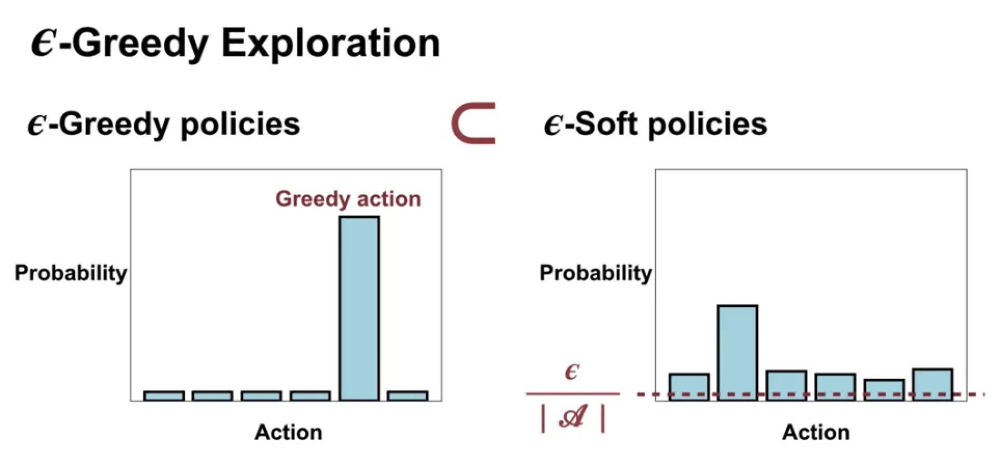
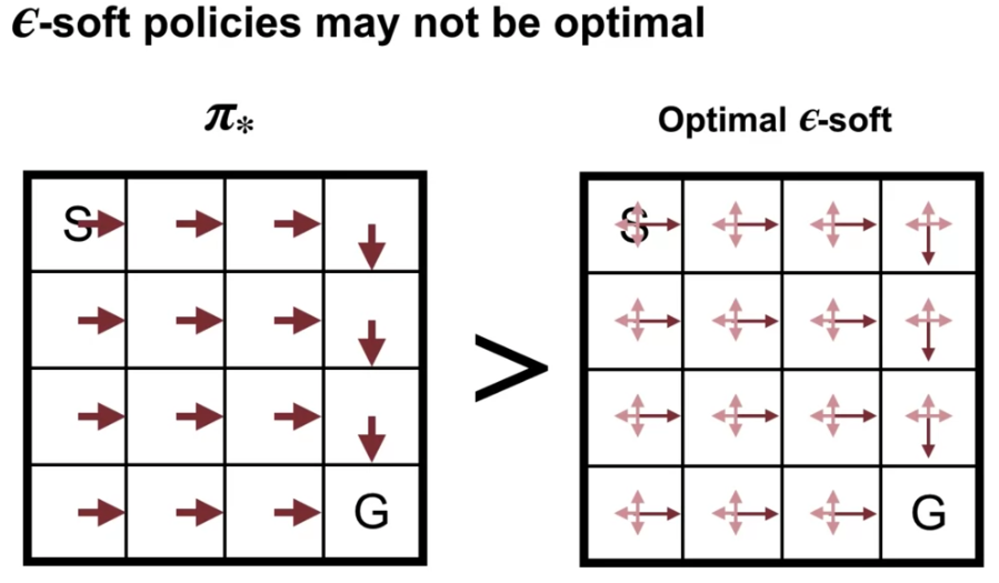
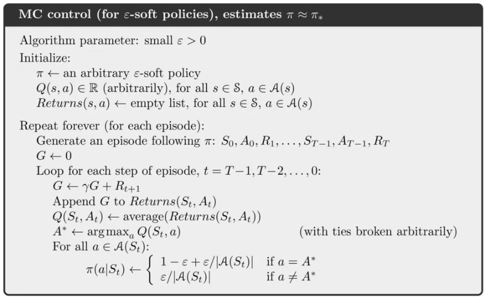
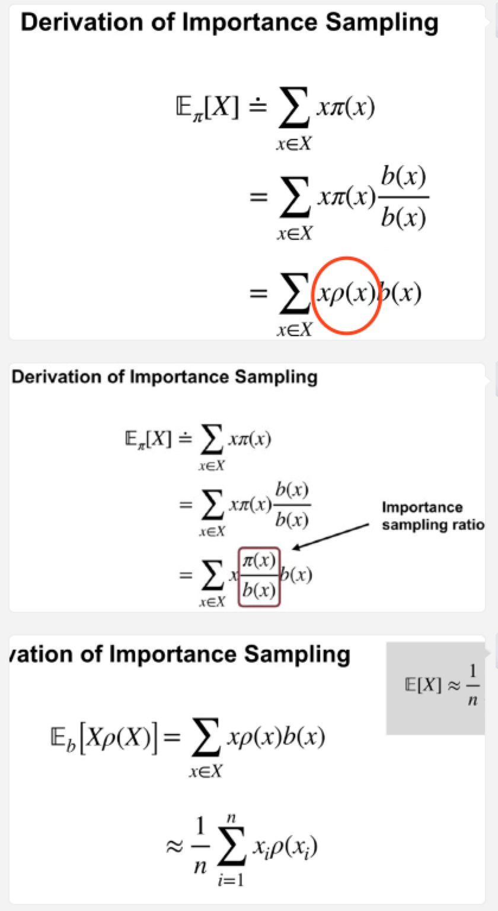

## Module 01: Monte Carlo Methods for Prediction & Control 
#### Lesson 1: Introduction to Monte Carlo Methods 
* Understand how Monte-Carlo methods can be used to estimate value functions from sampled interaction
  * MC methods estimate values by **averaging** over a large number of **random samples**.
  * 采样越多，找到的解越接近最优解 => As the number of samples increases, the average tends to get closer and closer to the expected return.
  * 
  The Monte Carlo algorithm has to keep track of multiple observed returns
  * MC method can learn directly from interacton, they don't need a model the environments dynamics.
* Identify problems that can be solved using Monte-Carlo methods
  * In some problems we don't know the environment's transition probabilities. => use MC
  * We dont need to keep a **large model** of the environment
  * We are estimating the value of an **individual** state independently of the values of other states. HOWEVER, in dynamic programming, the value of each state depends on the values of other states. (*DIFFERENCE*)
  * The **computation** needed to update the value of each state **doesnt** depend on the size of the MDP ❌-> depends on the length of an episode ✅
* Use **Monte Carlo prediction** to estimate the value function for a given policy. 
Example: Blackjack 二十一点！ -> reform this game as an **undiscounted MDP** (assume cards are dealt from a deck with replacement)
  * where each game of blackjack corresponds to an episode.
  * Rewards: loss -1, draw 0, win 1
  * ActionL Hit or Stick
  * States (*200 in total*):
    * whether the player has a usable Ace(counted as 11) (yes or no)
    * The sum of the player's cards (12-21)
    *  The card the dealer shows(Ace - 10)
 *  Policy: Stop requesting cards when the player's sun is 20 or 21
* In what situations could off-policy learning be more data efficient that on-policy learning?
  * Off-policy means using two different policies, one the target policy, to be learned, and another the off-policy to make sure we do also explore for more optimal actions. This can be a preferred option when a more general policy is required. For example if we learn from generated data from a conventional controller or human expert. In short, more real world dynamics situation.
  * ***Off-polic***y learning could be better when there are lots of different actions that could proof to be ultimately better in the long run, but poor choices short and intermediate term. 
  * ***On-policy*** learning would not explore and find these (very long term good action sequences) because it only explores short-term but then selects greedily. It would not find a sequence of several poor choices before it pays off, because of the high probability of greedy choices.
  

#### Lesson 2: Monte Carlo for Control 
* Estimate action-value functions using Monte Carlo
  * We learned the value of a state by averaging sample returns from that state, same as action values.
* Understand the importance of maintaining exploration in Monte Carlo algorithms 
  *  If we don't ever try the new way, then we couldn't know if it was actually better
  *  Exploring starts - one way to maintain exploration

* Understand how to use monte carlo methods to implement a **GPI algorithm**
  * 
  * GPI algorithms produce sequences of policies that are at least as good as the policy before them. 
  * Policy improvement step -> make policy greedy wrt. the agent current action value estimates.
  * policy evaluation step -> use ***MC estimate*** to estimate action values. 
  * 
    * You use exploring starts so that each episode begins with a randomly selected state and action. 
    * Then, the agent generates an episode by following his policy, keeping track of the states, actions, and rewards along the way. 
    * Once the episode is complete, it computes each return starting from the end of the episode. Then, it adds the return to the appropriate list. The list of returns are then averaged to update the action value estimates for each state-action pair. 
    * This completes the policy evaluation step. After policy evaluation, then do policy improvement. We simply update the policy to take the greedy action with respect to our updated action values. 
* Apply Monte Carlo with exploring starts to solve an MDP 

#### Lesson 3: Exploration Methods for Monte Carlo 
* Understand why Exploring Starts can be problematic in real problems 
  * Epsilon soft policies are policies help with the continual exploration Problem by having some small probability of exploring on each time step.
  * The disadvantage of Epsilon soft policies is that they are suboptimal for both acting and learning
  * Some situation we cannot use exploring start:
    * some situation will reach sub optimal
    * We need to ensure the agent might start from all possible states.
    * We learn all action values w/o exploring starts - stochastic policies
    * 
    * epsilon-soft policies are always **stochastic deterministic**
    * Epsilon greedy policies are a subset of a larger class of policies called Epsilon soft policies Epsilon soft policies take each action with probability at least Epsilon over the number of actions. For example, both policies shown on this picture are valid Epsilon soft policies. **The uniform random policy is another notable Epsilon South policy.**
    * Force the agent to continue explore. assigns non-0 probability to each action in every statte -> continue visit each state!
* Describe an alternative exploration method for Monte Carlo control 
  * 
  * If our policy always gives at least Epsilon probability to each action, it's impossible to converge to a deterministic optimal policy exploring starts can be used to find the optimal policy. But that's on soft policies can only be used to find the optimal Epsilon soft policy. That is the policy with the highest value in each state out of all the Epsilon soft policies.
  * This policy performs worse than the optimal policy in general. However, it often performs reasonably. Well and allows us to get rid of exploring starts.
  * 
  * There's one change to the initial conditions 
  * one change to the policy evaluation step 
  * and one change the policy Improvement step.

#### Lesson 4: Off-policy learning for prediction 
* Understand how off-policy learning can help deal with the exploration problem 
  * On-policy: in **on policy** learning the agent learns about the policy **used to generate the data.** 
  * Off-policy: The agent learns about a policy from data generated by following a **different policy**. That is the policy that we are learning is off the policy. They we are using for Action selection. For example, you could learn the optimal policy while following a totally random policy
  * Target policy: the policy that the agent is learning the target policy because it is the target of the agents learning the target policy is usually denoted by π
  * Behaviour policy: the policy that the agent is using to **select actions** the behavior policy because it defines our agents Behavior. -> B
    * Behaviour policy must cover the target policy
    * on policies the specific case where the target policy is equal to the behavior policy. 
* Produce examples of target policies and examples of behavior policies.
  * The policy that we are learning is called the target policy and the policy that we are choosing actions from is the behavior policy.
* Understand importance sampling
  * 
  * 
* Use importance sampling to estimate the expected value of a target distribution 见上图公式推导
* Using samples from a different distribution. 
* 
* Understand how to use importance sampling to correct returns
* Understand how to modify the monte carlo prediction algorithm for off-policy learning. 

QUIZ:
1. Which approach ensures continual exploration?
   1. Exploring starts: guarantee that all state-action pairs are visited an infinite number of times in the limit of an infinite number of episodes.
   2. On-policy learning with an epsilon-soft policy: assign non-zero probabilities to all state-action pairs
   3. Off-policy learning with an epsilon-soft behavior policy and a deterministic target policy: have non-zero probabilities for all actions in all states. The behavior policy is used to generate samples and should be exploreatory.
2. When can Monte Carlo methods, as defined in the course, be applied?
   1. Well-defined returns are available in episodic tasks.
3. Which of the following learning settings are examples of off-policy learning?
   1.  Off-policy learning enables learning about multiple target policies simultaneously using a single behavior policy.
   2.  An off-policy method with an exploratory behavior policy can assure continual exploration.
   3.  Applications of off-policy learning include learning from data generated by a non-learning agent or human expert. The policy that is being learned (the target policy) can be different from the human expert’s policy (the behavior policy).
4.  When does Monte Carlo prediction perform its first update? - At the end of the first episode
5.  In Monte Carlo prediction of state-values, **memory** requirements depend on
    1.  the number of states
    2.  the length of episodes
6.  For Monte Carlo Prediction of state-values, the number of **updates** at the end of an episode depends on - the length of the episode
7.  Which approach can find an optimal deterministic policy? 
    1.  Exploring starts
    2.  off-policy learning with an epsilon-soft behaviour policy and a deterministic target policy

