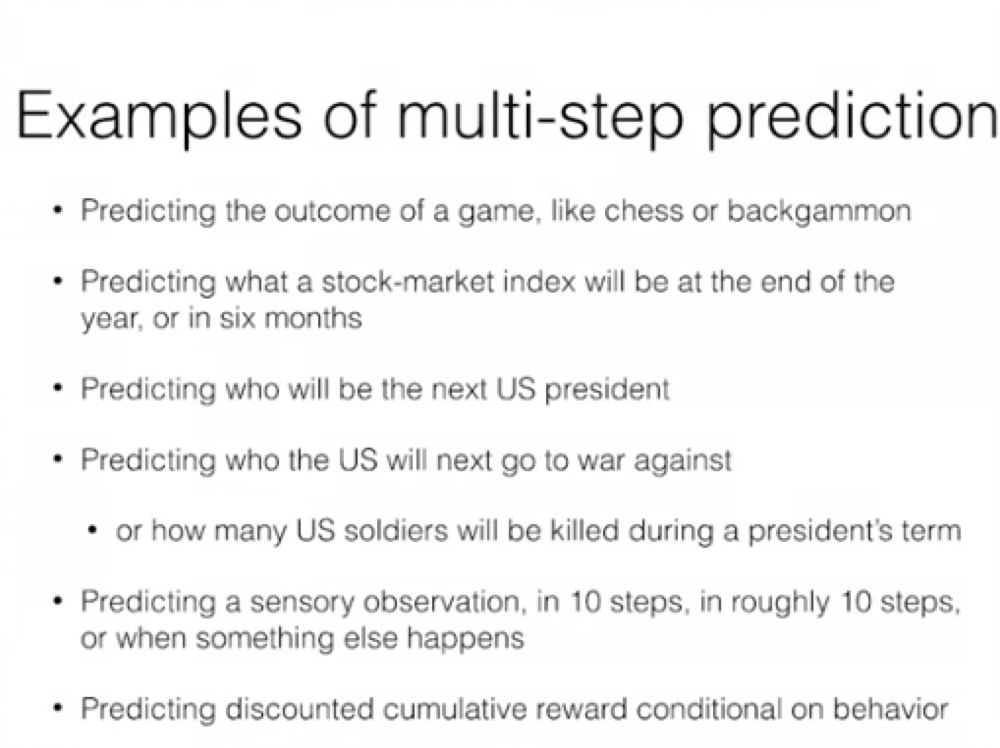
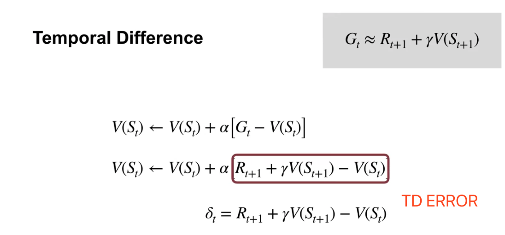
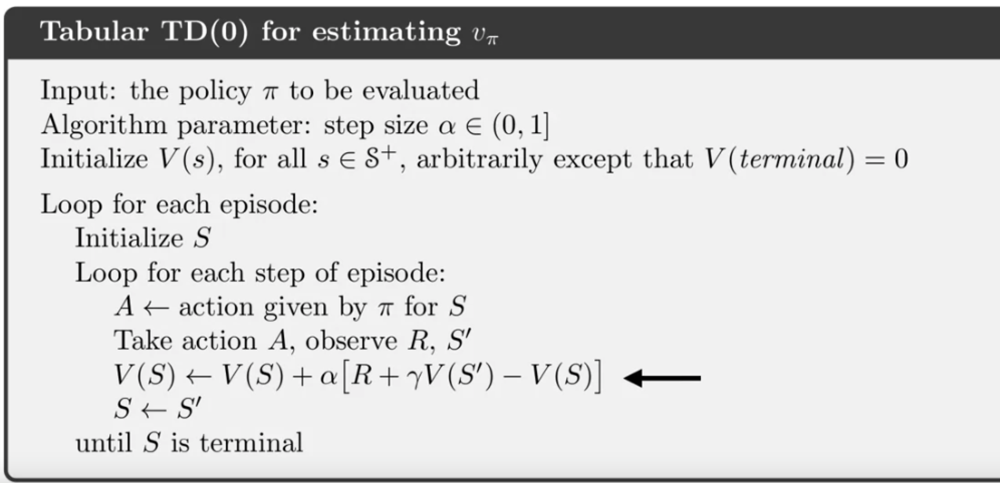
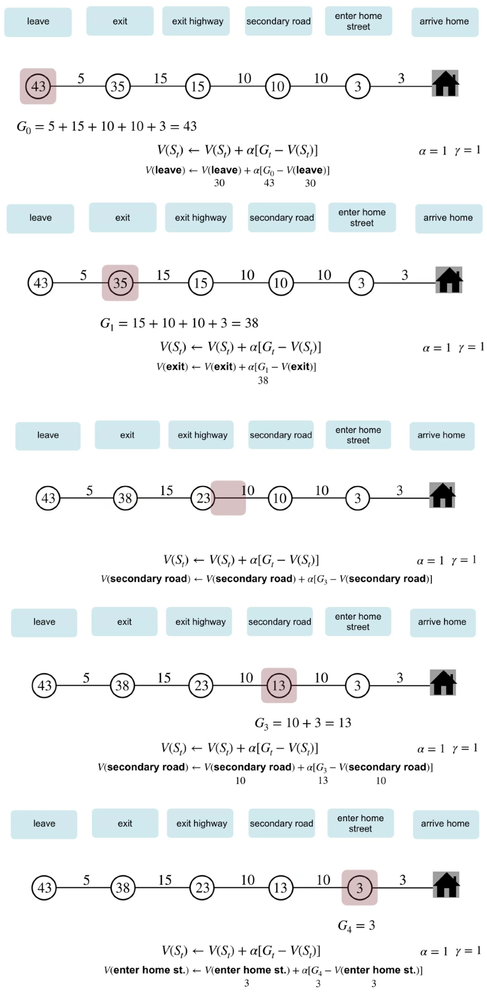
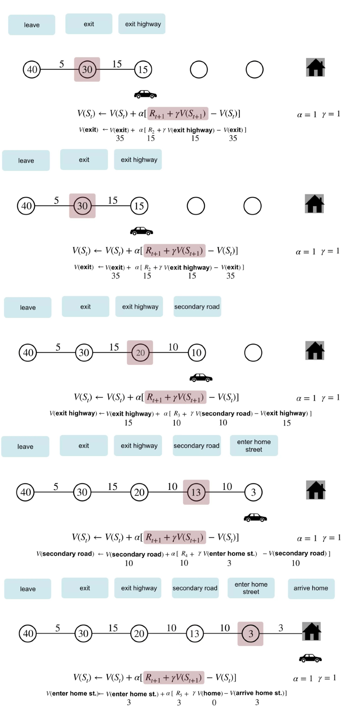
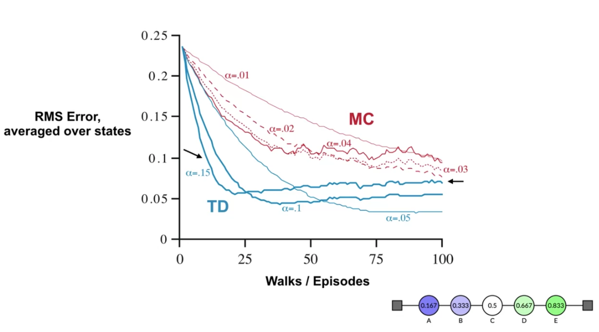

## Module 2 & 3: emporal Difference Learning Methods for Prediction & Temporal Difference Learning Methods for Control 

### Lesson 1: Introduction to Temporal Difference Learning 
* Define Temporal Difference learning
  * TD learning is a combination of Monte Carlo ideas and dynamic programming (DP) ideas, relevant only on multi-step prediction problems
  * 
  * A way to incrementally estimate the return through **bootstrapping** 
  * TD learning is learning a prediction from another, later, learned prediction
    * ie. learning a guess from a guess
    * the TD error is the difference b/w the two predictions, the temporal difference.
    * otherwise TD learning is the same as supervised learning, vackpropagating the error
* Define the temporal-difference error 
 
We will often see the TD error denoted by delta t
* Understand the TD(0) algorithm 
  
  TD can update its value estimates on each step of the episode. It does not have to wait for the episode to complete. It just has to remember the previous state.

* Should we care about TD in the brain?
TD gives us a reasonable model for explaining some aspects of learning in the brain. Should we care if TD is happening in the brain? And why might TD be a better fit for modeling how we make predictions, than methods like Monte Carlo?
  * I guess we should, given that the brain is the best predictive machine we know at the moment. TD could be a better model than Monte Carlo because it doesn't need to wait until the end of an episode, and it is immediate continuous learning from the current experience (which seems to better resemble biological learning).

### Lesson 2: Advantages of TD 
* Understand the benefits of learning online with TD
  * TD elegantly combines key ideas from dynamic programming and Monte Carlo methods. 
  * Like dynamic programming, TD methods **bootstrap**. 
  * Like Monte Carlo methods, TD can learn **directly from experience. **
#### MC car park estimate example: 
  
  we will use the constant alpha Monte Carlo method with alpha equal to one. In Monte Carlo methods, you update your estimates towards the return which is only available at the end of the episode. We can only update the estimates for each of the states once we arrive home.
#### TD car park estimate example:
  
  we can learn online without waiting for the episode to end!!
* Unlike dynamic programming, TD methods do not require a model of the environment. They can learn directly from experience. 
  * Unlike Monte Carlo, TD can update the values on every step. Bootstrapping allows us to update the estimates based on other estimates. 
  * TD asymptotically converges to the correct predictions. 
  * In addition, TD methods ***usually converge faster than*** Monte Carlo methods.
* Identify key advantages of TD methods over Dynamic Programming and Monte Carlo methods
  * TD often converges faster than Monte Carlo, 
  * TD does not require a model unlike dynamic programming, 
  * and TD is online and fully incremental unlike either Monte Carlo or dynamic programming.

  The red learning curves represent the performance of Monte Carlo for several values of Alpha. Each curve is averaged over a 100 independent runs. 

  For instance, this point represents the average error achieve after 50 episodes for the learning rate 0.01. 

  Now, let's look at TD's performance. We see that TD perform consistently better than Monte Carlo. The error reduces faster with a learning rate of 0.15, but ultimately, results in higher final error. 

  With a smaller learning rate, TD learns more slowly but achieves lower final error. 

  In summary, we ran a careful experiment comparing TD and Monte Carlo, and the results suggest that TD converges faster to a lower final error in this problem.

* Identify the empirical benefits of TD learning 

Quiz：
