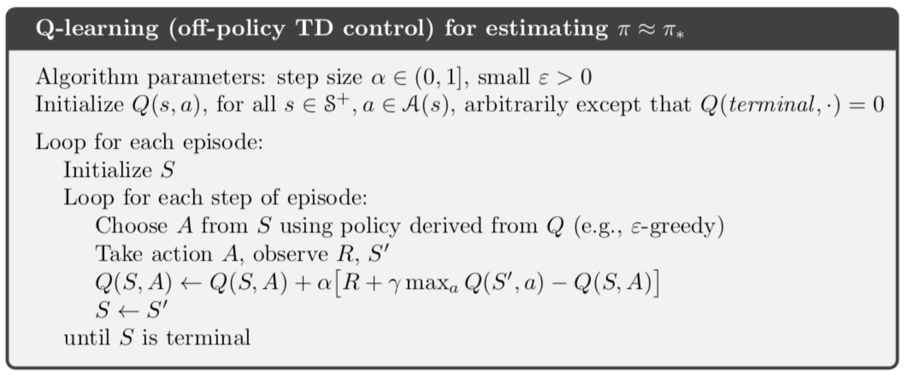
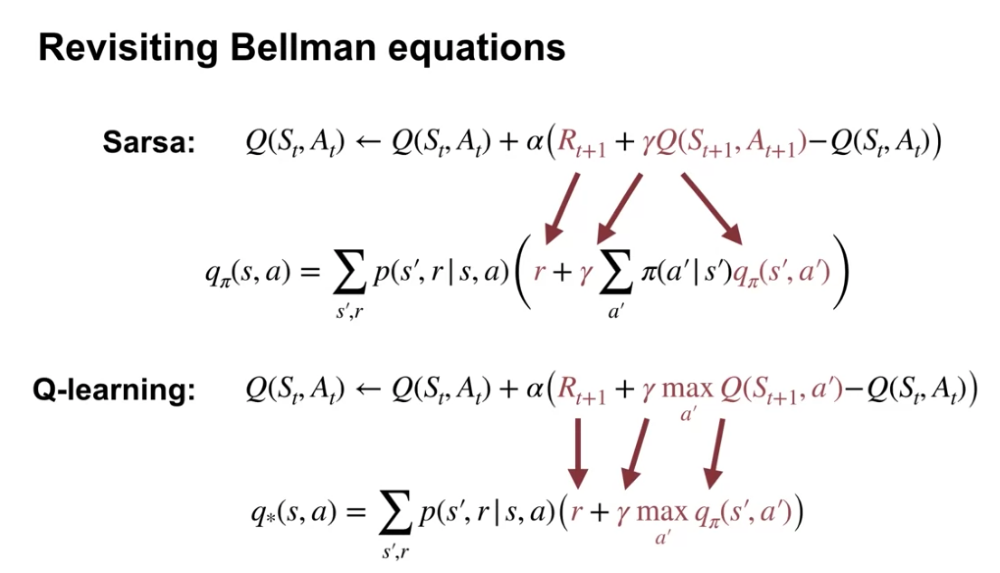

## Module 3: emporal Difference Learning Methods for Prediction & Temporal Difference Learning Methods for Control 

### Lesson 1: TD for Control 
* Explain how generalized policy iteration can be used with TD to find improved policies 
  * Monte Carlo methods wait until the return following the visit is known, then use that return as a target for V (St)
    * V (St) <-  V (St) + α[G_t - V (St)], where Gt is the actual return following time t, and α is a constant step-size parameter
* Describe the Sarsa Control algorithm
  * SARSA learned slowly for the first couple of episodes. Then, it improved exponentially before plateauing.
  * Instead of looking at transitions from state to state and learn the value of each state, let's look at transitions from state action pair to state action pair and learn the value of each pair. This algorithm is called Sarsa prediction
  * the GPI algorithm that uses TD for policy evaluation
  * Sarsa control is an example of GPI with TD learning.
* Understand how the Sarsa control algorithm operates in an example MDP
* Analyze the performance of a learning algorithm 
  * why q is better than sarsa in that case?
  * Perhaps the update target of Q-Learning is more stable. Q-Learning takes the max over next action values. So it only changes when the agent learns that one action is better than another. In contrast, SARSA uses the estimate of the next action value in its target. This changes every time the agent takes an exploratory action. 

### Lesson 2: Off-policy TD Control: Q-learning 
* Describe the Q-learning algorithm
  * 
  * The agent chooses an action in a state, takes the action, and observes the next state and reward. Then the agent does an update and the cycle repeats.
  * new in q learning: action value update
* Explain the relationship between q-learning and the Bellman optimality equations. 
  * 
  * Sarsa is a sample-based algorithm to solve the Bellman equation for action values. 
  * Q-learning also solves the Bellman equation using samples from the environment.
  *  But instead of using the standard Bellman equation, Q-learning uses the Bellman's Optimality Equation for action values. 
  *  The optimality equations enable Q-learning to directly learn Q-star instead of switching between policy improvement and policy evaluation steps.
* Apply q-learning to an MDP to find the optimal policy
* Understand how Q-learning performs in an example MDP
* Understand the differences between Q-learning and Sarsa
  *  Perhaps SARSA'S policy will perform better because its value function takes into account it's Epsilon-greedy behavior. Maybe Q-Learning will learn faster because it directly learns the optimal policies value function

* Understand how Q-learning can be off-policy **without** using **importance sampling** 
  * When the target policy and behavior policy are the same, the agent is learning on-policy, otherwise, the agent is learning off-policy.
  * Sarsa is an on-policy algorithm. In Sarsa, the agent bootstraps off of the value of the action it's going to take next, which is sampled from its behavior policy.
  * Q-learning instead, bootstraps off of the largest action value in its next state. This is like sampling an action under an estimate of the optimal policy rather than the behavior policy. -> off policy
* Describe how the on-policy nature of SARSA and the off-policy nature of Q-learning affect their relative performance 
  * Since Q-learning learns the optimal value function, it quickly learns that an optimal policy travels right alongside the cliff. However, since his actions or epsilon greedy, traveling alongside the cliff occasionally results and falling off of the cliff. 
  * Sarsa learns about his current policy, taking into account the effect of epsilon greedy action selection. Accounting for occasional exploratory actions, it learns to take the longer but more reliable path. They usually avoids randomly falling into the cliff. -> more reliablely 

### Lesson 3: Expected Sarsa 
* Describe the Expected Sarsa algorithm
  * Sarsa estimates this expectation by sampling the next date from the environment and the next action from its policy.
  *  the expected Sarsa algorithm explicitly computes the expectation under its policy, which is more expensive than sampling but has lower variance.

* Describe Expected Sarsa’s behaviour in an example MDP
* Understand how Expected Sarsa compares to Sarsa control
* Understand how Expected Sarsa can do off-policy learning without using importance sampling
* Explain how Expected Sarsa generalizes Q-learning 