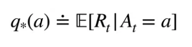

**Lesson 1: The K-Armed Bandit Problem**
* Understand the temporal nature of the bandit problem
  * Samilarity b/w ~ and SUpervised lreaning:
    * the agent does receive some rewards (just like labels in supervised learning)
  * Difference b/w ~ and Supervised learning: 
    * Dataset is not explicitly provided in Bandits with results. Actions are taken and reward is observed
    * there is not necessarily a right or wrong "label" - an action can be rewarding or less rewarding - or not rewarding at all
    * 
* Define k-armed bandit
    * https://blog.csdn.net/pouqiyu5090/article/details/84898609 
    * https://zhuanlan.zhihu.com/p/30822777
* Define action-values
  * The **value** of an action is the **expected reward** when that action is taken: 
* Define reward

**Lesson 2: What to Learn? Estimating Action Values**
* Define action-value estimation methods
  * $q*(a)$ in the above formula is **unknow**, then we estimate it.
  * Understand a simple online sample-average action-value estimation method: 
* Define exploration and exploitation
  * *Exploration* allows the agent to improve his knowledge about each action for long-term benefit. By improving the accuracy of the estimated action values, the agent can make more informed decisions in the future
  * *Exploitation* exploits the agent's current estimated values for short-term benefit. It chooses the greedy action to try to get the most reward. But by being greedy with respect to estimated values, may not actually get the most reward. 
* Select actions greedily using an action-value function
  *  The greedy action is the action that currently has the largest estimated value. Selecting the greedy action means the agent is exploiting its current knowledge. It is trying to get the most reward it can right now. We can compute the greedy action by taking the argmax of our estimated values
  *  Alternatively, the agent may choose to explore by choosing a non-greedy action. The agent would sacrifice immediate reward hoping to gain more information about the other actions.
* Define online learning
* Define the general online update equation:
  * Q1 -> initial action value
  * New reward is our target
  * StepSize is a functon n from 0 to 1
* Understand why we might use a constant stepsize in the case of non-stationarity
  * Non-stationarity problem:  What if one of the treatments was more effective under certain conditions? Specifically, let's say the treatment B is more effective during the winter months.
  * These problems are like the bandit problems  before, **except** the distribution of rewards **changes** with time. The doctor is **unaware** of this change but would like to adapt to it. 
  * One option is to use a fixed step size. If Alpha_n(StepSize) is constant like 0.1, then the most recent rewards affect the estimate more than older rewards.
 

**Lesson 3: Exploration vs. Exploitation Tradeoff**
* Compare the short-term benefits of *exploitation* and the long-term benefits of *exploration*
  * Choose randomly?
  * $epsilon$ greedy -> eps refers to the **probability** of choosing to exolore 
    * A_t: the action that we select on time-step t
    * A_t is the greedy action with probability one minus epsilon or is a random action with probability epsilon
* Understand optimistic initial values
  * The doctor would continue this way, always assuming the treatments are maximally effective, until shown that the estimated values need to be corrected.
  * Now, our doctor optimistically assumes that each treatment is highly effective before running the trial.
* Describe the **benefits** of optimistic initial values for early exploration
  * From this example, we can see that using optimistic initial values encourages exploration early in learning. The doctor tried all three of the treatments in the first three time steps, and continued to try all treatments afterwards
* Explain the **criticisms** of optimistic initial values
  * In early learning, the optimistic agent performs worse because it explores more. Its exploration decreases with time, because the optimism and its estimates washes out with more samples.
  * One limitation is that **optimistic initial values only drive exploration early in learning,** this means agents will not continue exploring after some time.
  * They are not very suitble for nonstationary problem: For example, one of the action values may change after some number of time steps. An optimistic agent may have already settled on a particular action, and will not notice that a different action is better now. 
  * Another potential limitation is that we may not always know how to set the optimistic initial values, because in practice we may not know the maximal reward
* Describe the upper confidence bound action selection method
  * 
    * we will select the action that has the highest estimated value plus our upper-confidence bound exploration term.
    * The C parameter as a user-specified parameter that controls the amount of exploration.
    *  Let's say we've taken 10,000 steps so far. Imagine we've selected action A 5,000 times. The uncertainty term here will be 0.043 times the constant C. If instead we had only selected action A 100 times, the uncertainty term would be 10 times larger.
    * 每次行为a被选中，则N_t(a)增加，不确定项就会减小，不确定性会下降。另一方面，每次其它行为被选中，t增加了但N_t(a)并没有，a不确定的估计就会增大。使用自然对数因其增长随时间减小，但却是无界的；所有的行为都逐渐会被选中，不过随着时间的增长等待的时间会更长，因此对于那些价值估计更低或已被更多次选择的行为被选中的频率就会更低。
* Define optimism in the face of **uncertainty**
  * If we are uncertain about something, we should optimistically assume that it is good
  * For instance, say we have these three actions with associated uncertainties, our agent has no idea which is best. So it optimistically picks the action that has the highest upper bound.
