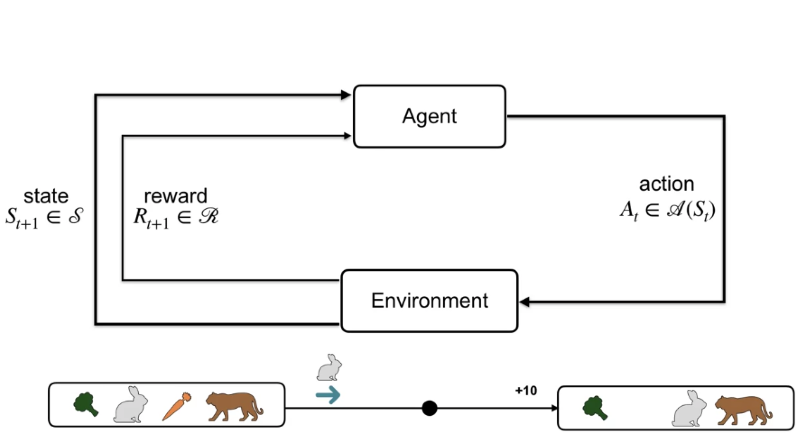
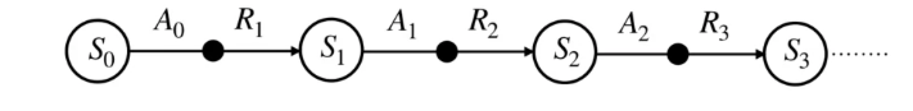
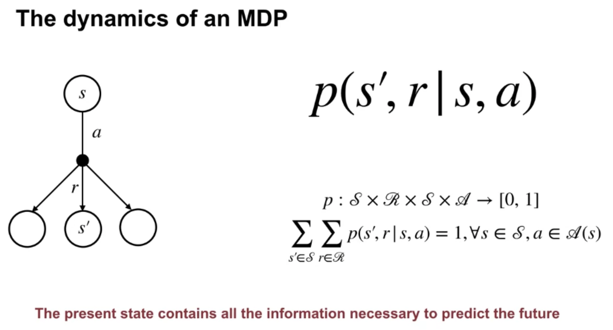

## **Lesson 1: Introduction to Markov Decision Processes**

* Understand Markov Decision Processes, or MDPs
  * Highlight - how badits and MDPs differ:
    * The k-Armed Bandit problem does not account for the fact that different situations call for different actions.
    *  A bandit rabbit would only be concerned about immediate reward and so it would go for the carrot. But a better decision can be made by considering the long-term impact of our decisions.
   *  Each state the rabbits select an action, **Actions influence immediate rewards as well as future states and through those, future rewards.**   

* Describe how the dynamics of an MDP are defined
  * As in bandits -> outcomes are stochastic and we use the language of probabilities
  * 
    * The transition dynamics function P, formalizes this notion
    * Given a state S and action a, p tells us the joint probability of next state S' and reward are. (we assume the set of state, actions and rewards are finite.)
  * Since p is a probability distribution, it must be non-negative and it's sum over all possible next states and rewards must equal one.
  * future state and reward only depends on the current state and action. This is called the Markov property. 
  * the present state is sufficient and remembering earlier states would not improve predictions about the future. 

* Understand the graphical representation of a Markov Decision Process

  

* Explain how many diverse processes can be written in terms of the MDP framework (**flexibility**) 见下面这个

* The MDP framework is **abstract and flexible** and can be applied to many different problems in many different ways. 

  * For example, the **time steps** need not refer to fixed intervals of real time; they can refer to arbitrary successive stages of decision making and acting. 

  * The **actions** can be low-level controls, such as the voltages applied to the motors of a robot arm, or high-level decisions, such as whether or not to have lunch or to go to graduate school

  * The **states** can take a wide variety of forms. They can be completely determined by low-level sensations, such as direct sensor readings, or they can be more high-level and abstract, such as symbolic descriptions of objects in a room. Some of what makes up a state could be based on memory of past sensations or even be entirely mental or subjective.

## **Lesson 2: Goal of Reinforcement Learning** 

* Describe how rewards relate to the goal of an agent

* Understand episodes and identify episodic tasks

## **Lesson 3: Continuing Tasks**

* Formulate returns for continuing tasks using discounting

* Describe how returns at successive time steps are related to each other

* Understand when to formalize a task as episodic or continuings